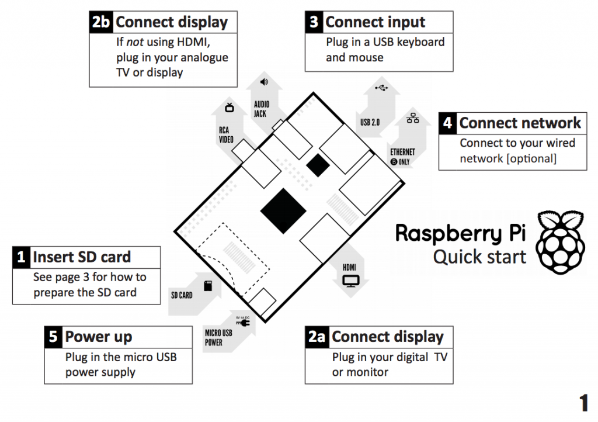
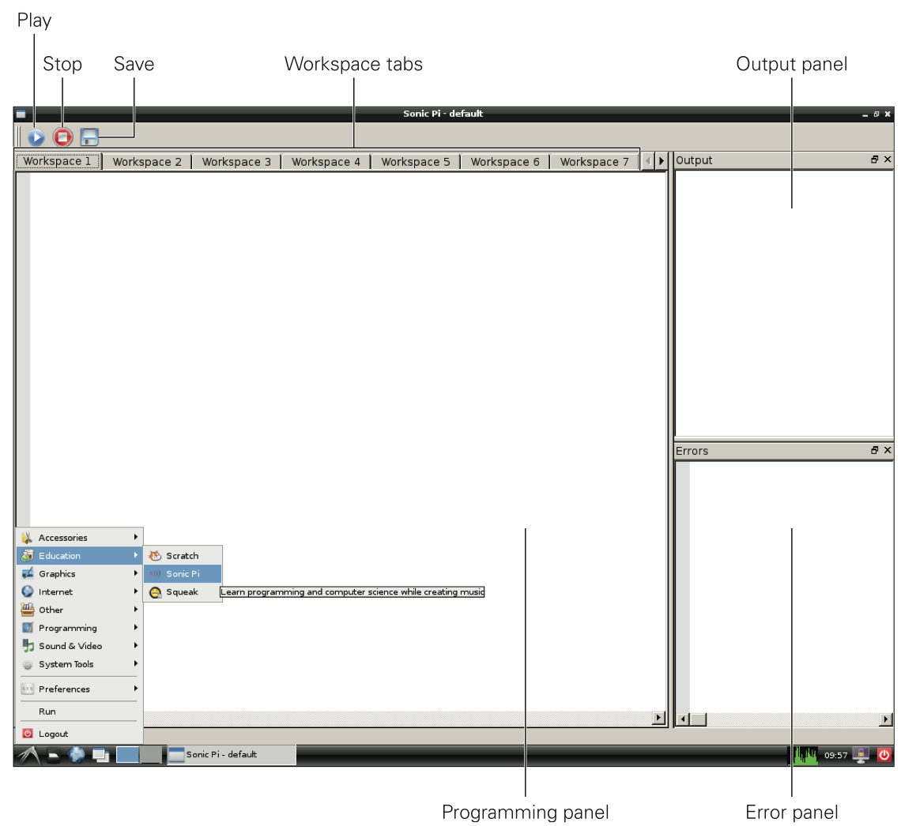

# Creating Music with Sonic Pi

**Introduction**

We are going to make some funky songs on the Raspberry Pi. A Raspberry Pi is a small computer that we can use to create exciting technology. It was created in the UK by the Raspberry Pi Foundation to help young people like you learn how to code.

This small computer features amazing HD (high-definition) quality video and playback, sports high quality audio and has the ability to play 3D games.

To get going with your Raspberry Pi, you will need to connect cables and add an SD card before logging in.

## Step 0: Setting Up your Pi
First check that you have all the parts you need to get your Raspberry Pi set up and working:

- Raspberry Pi
- Micro USB power adapter
- An SD Card with Raspbian already set up through NOOBS
- USB Keyboard
- USB Mouse
- HDMI cable
- A Monitor or TV
- Some headphones 

**Activity Checklist:**

1.	Place the SD card into the slot of your Raspberry Pi. It will only fit one way so be careful not to break the card. 

2.	Next connect the HDMI cable from the monitor (or TV) to the HDMI port on the Pi and turn on your monitor. 

3.	Plug in a USB keyboard and Mouse into the USB slots on the Pi.

4.	Plug in your headphones to the 3.5mm sound output jack.

5.	Plug in the micro USB power supply and you should see some text appear on your screen.

6.	When prompted to login type:

	```
	Login: pi
	Password: raspberry
	```

7.	Once you have logged in, type startx to load the desktop.



## Step 1: First Sounds with Sonic Pi

Let’s play some sounds. 

This is the Sonic Pi application interface. It has three windows. The largest one is for writing your code and we call it the Programming Panel. The top right hand window is the Output Panel and it displays information about your program as it runs. Underneath is the third window; the ‘Error Panel’ which displays information if there is a problem with your program or a bug.



**Activity Checklist:**

1.	Launch Sonic Pi by clicking on the Main Menu, then Education, and then Sonic Pi.
2.	Select Workspace 1.
3.	Type: 

  ```ruby
  play 60
  ```
4.	Click on the play icon at the top of the screen. What happens?

5.	What happens if you type ```pley 60``` and click on the play icon?

  This is an example of a bug in your code. In later activities, if the error panel displays text you will know that you    have a bug that you need to fix. It could be that you have miss-spelt a word like ```play```.

6.	Now type:

  ```ruby
  play 60
  play 67
  play 69
  ```
7.	Click on the play icon at the top of the screen. What happens?

  The computer is playing each note in sequence (ne after the after) but it is happening so fast that to us they sound      like they are playing at the same time. 

8.	We need to tell the computer to pause between each note. We can do this by typing the following after each play:

  ```ruby
  sleep 1 
  ```
The value entered after the word sleep represents time in seconds. Using the value 1 represents one second. What would you type for half a second?

9.	Now write a sequence of play and sleep to make a cool sounding tune!

## Step 2: Frere Jacques

Now you have mastered the basics of Sonic Pi, let’s code a tune! 

The values that you have been typing after the word 'play' represent notes. In fact they are MIDI note numbers. This means we can translate songs played on a piano into Sonic Pi!

We are going to code 'Frere Jacques'. The song begins with:

`C D E C` 	or	`60 62 64 60` 	in MIDI notes.

**Music Notes to MIDI Note Values**

| C       | D      | E     | F     | G     | A     | B     |
| :-----: |:------:|:-----:|:-----:|:-----:|:-----:|:-----:|
| 60      | 62     | 64    | 65    | 67    | 69    | 71    |


**Activity Checklist:**

1.	Select Workspace 2.

2.	Type the following code:

  ```ruby
  play 60
  sleep 0.5
  play 62
  sleep 0.5
  play 64
  sleep 0.5
  play 60
  sleep 0.5
  ```
3.	Now click on the play icon at the top of the screen and it will play the first part of ‘Frere Jacques’. 

  This first section plays twice. How could you repeat it? You could type the same section out again, or we could start to   introduce loops to your code.

4.	At the top of your code, above the first play 60 type:

  ```ruby
  2.times do
  ```

5.	And at the bottom of your code, below sleep 0.5 type:

  ```ruby
  end
  ```

6.	Click on the play icon at the top of the screen. What happens?

  Let’s play this part in Sonic Pi.

  In this example, you can see that some lines of code are indented. This makes it easier to read your code and check for   any bugs if it does not work when you press the play button. You can press the space bar twice to indent a line of code.

  ```ruby
  2.times do
    play 60
    sleep 0.5
    play 62
    sleep 0.5
    play 64
    sleep 0.5
    play 60
    sleep 0.5
  end
  ```

**Things to try:**

A) Complete the Frere Jacque song by using the table to translate musical notes into Sonic Pi note values.

C   D   E   C   C   D   E   C

E   F   G   E   F   G

G   A   G   F   E   C   G   A   G   F   E   C

C   D   E   C   C   D   E   C

B) Create your own tune using what you have learned so far.


## Step 3: Change the Sounds

It’s time to make your tune sound more interesting! We can do this by changing the synthesizer sounds it is using. The default Sonic Pi synth is called `"pretty_bell"`. 

To use a different synth, you need to add the code: `with_synth "name of synth"` above the sequence of code you want to use it.

In this example, `"fm"` is the name of the synth:

```ruby
with_synth "fm"
2.times do
  play 60
  sleep 0.5
  play 67
  sleep 0.5
end
```

**Synths to try:**
```ruby
"pretty_bell"
"dull_bell"
"beep"
"saw_beep"
"fm"
```

**Activity Checklist:**

1.	At the top of your code, above the 2.times do add the following:

  `with_synth "fm"`

2.	Click on the play icon at the top of the screen. 

3.	Change the synth to find one that you like the sound of from the table of synths to try.


##Step 4: Using Functions 

Currently your Sonic Pi version of Frere Jacques is playing in a set key. It always plays the same notes from the same octave. To give your program the ability to use a different set of notes we can use a function. 

Functions are a named group of statements. You could put the first part of Frere Jacque in a function like this:

```ruby
def frere
  play 60
  sleep 0.5
  play 62
  sleep 0.5
  play 64
  sleep 0.5
  play 60
  sleep 0.5
end
```

And then call the function to play by typing `frere`. However this does not solve our problem of being able to use a different key. Let's solve this problem now!

**Activity Checklist:**

1. 	Open a new workspace in which to store your code.

2. 	Let's begin by creating a function for the first part of the song:

	```ruby
	def frere(n)
      play n
      sleep 0.5
      play n + 2
      sleep 0.5
      play n + 4
      sleep 0.5
      play n
	end
	```

	If you press the play button. Nothing will happen. You need to call the function underneath by leaving a space and 	typing `frere 60`. The value of the parameter 'n' here is 60, but you can change this value.
	
3. 	Change the value of 'n' by typing `frere 40` or `frere 80`

	You will hear the tune play with a different key each time. 

##Step 5: Playing two tunes at the same time

Music often has a repeating backing track with a separate melody played over the top. So far in Sonic Pi you have played one tune. Let’s try playing two tunes at the same time!

**Activity Checklist:**

1.	Click on a new workspace tab.

2.	The code we use to play two tunes at the same time needs to be encased in `in_thread do` and `end`

3.	Underneath type your tune. Here I’ve used Frere Jacques from the earlier activity:

    ```ruby
    in_thread do
      with_synth "saw_beep"
      2.times do
        play 60
        sleep 0.5
        play 67
        sleep 0.5
      end
    end
    ```
  
  This first 'thread' will act as the melody of your music. Underneath you can type the code for your backing track or      baseline. 

4.	Type:

    ```ruby
    in_thread do
      with_synth "pretty_bell"
      30.times do
        play 49
        sleep 1
      end
    end
    ```
  
